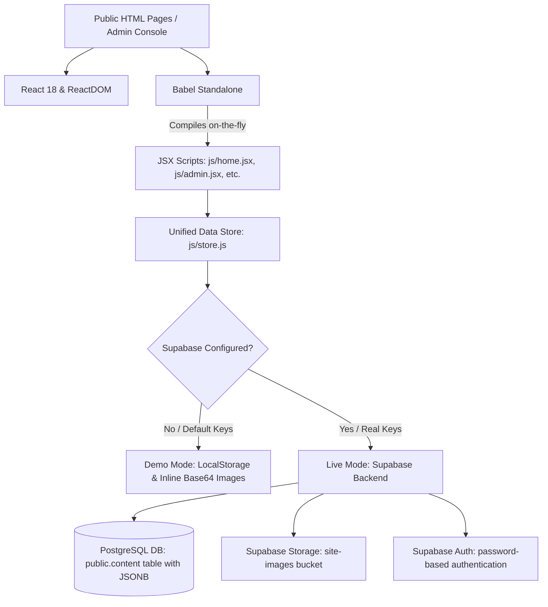

# 🌌 Roboverse — IIT Dharwad Robotics Club Website

Welcome to the **Roboverse** repository! This is the official student-built web platform for the **IIT Dharwad Robotics Club**. It serves as a modern showcase of the club's divisions, latest builds, achievements, timeline, and upcoming events, while offering a private administrative console to keep all content dynamic and easily manageable.

---

## 🏗️ Architecture Overview

The application is built with a **Zero-Build, Pure-Static SPA** architecture. It executes entirely in the browser, compiling code on-the-fly to deliver a highly interactive, modern web experience without requiring node modules, build runners (like Vite or Webpack), or complex server setups.



---

## 💻 Frontend Stack

The frontend is designed to be visually stunning, responsive, and performance-driven:

1. **Framework & Runtime Compiler:**
   - **React 18.3.1 & ReactDOM** (loaded via unpkg CDN) are used to write component-driven views.
   - **Babel Standalone** (`@babel/standalone` v7.29.0 via unpkg CDN) compiles JSX files directly in the user's browser at runtime.
2. **Styling System (Vanilla CSS):**
   - **Modern Typography:** Uses *Space Grotesk* for technical headings and *JetBrains Mono* for UI labels, tables, and numeric interfaces.
   - **Harmonious Palettes:** Leverages high-contrast colors and custom CSS Custom Properties (`--a1`, `--a2`) defined using modern `oklch()` color space for perfect gradients.
   - **Micro-Animations & Visuals:** Includes background grids, noise-grain overlays, smooth scroll animations, and fluid transition delays.
   - **Modular CSS Files:**
     - [css/styles.css](file:///run/media/rangerofdanger/Files/Projects/IIT%20Dharwad%20Robotics%20Club%20Website/css/styles.css): Core variables, grid/grain backgrounds, fonts, buttons, and top bar layouts.
     - [css/sections.css](file:///run/media/rangerofdanger/Files/Projects/IIT%20Dharwad%20Robotics%20Club%20Website/css/sections.css): Section layouts (heroes, marquees, headers, footers).
     - [css/pages.css](file:///run/media/rangerofdanger/Files/Projects/IIT%20Dharwad%20Robotics%20Club%20Website/css/pages.css): View-specific styles (projects, events, team grids, and timelines).
     - [css/admin.css](file:///run/media/rangerofdanger/Files/Projects/IIT%20Dharwad%20Robotics%20Club%20Website/css/admin.css): Layouts and styles for the administrative console.
3. **Interactive Tools:**
   - [tweaks-panel.jsx](file:///run/media/rangerofdanger/Files/Projects/IIT%20Dharwad%20Robotics%20Club%20Website/tweaks-panel.jsx): A floating, draggable design editor allowing real-time theme customization (accent colors, cursor styles, grid backdrops) and synchronizing choices with local preferences.

---

## 🗄️ Backend Stack & Unified Store

The application uses a unified data layer defined in [js/store.js](file:///run/media/rangerofdanger/Files/Projects/IIT%20Dharwad%20Robotics%20Club%20Website/js/store.js). It exposes a clean, asynchronous CRUD API to the admin console and switches backends based on configuration:

### 1. Supabase Backend (Live Mode)
Once real API credentials are provided in [supabase-config.js](file:///run/media/rangerofdanger/Files/Projects/IIT%20Dharwad%20Robotics%20Club%20Website/supabase-config.js), the website connects to a **Supabase** instance:
- **PostgreSQL Database:** Content is consolidated in a single table `public.content` configured with a flexible JSONB column (`data`). It stores different content types (`project`, `event`, `person`, `team`, etc.) within a uniform table schema.
- **Supabase Auth:** Secures database actions with password-based authentication.
- **Supabase Storage:** A public bucket named `site-images` stores and serves uploaded images.
- **Row Level Security (RLS):** Policies in [supabase/setup.sql](file:///run/media/rangerofdanger/Files/Projects/IIT%20Dharwad%20Robotics%20Club%20Website/supabase/setup.sql) ensure the public can read records, but only authenticated admin users can create, update, or delete content.

### 2. Browser LocalStorage (Demo Mode)
If API credentials are empty or placeholders, the store falls back to **Demo Mode**:
- **Mock DB:** Reads and writes to `localStorage` (key: `rc_content_v1`).
- **Inline Uploads:** Base64-encodes uploaded images and saves them inline.
- **Local Session:** Verifies logins against a local fallback password (`robotics-admin`).

---

## 📁 File Structure Map

```text
├── index.html                           # Home page shell (Latest builds, marquee, timeline)
├── about.html                           # About page shell (Club history, values, achievements)
├── projects.html                        # Projects overview (Filterable by category)
├── project.html                         # Project detail view (Dynamic router: project.html?id=slug)
├── events.html                          # Events listing (Live, upcoming, past)
├── event.html                           # Event detail view (Dynamic router: event.html?id=slug)
├── teams.html                           # Divisions & members layout
├── console-a7f3c9e2b8d14f6a93e0c5b1.html # Private admin dashboard (Unguessable URL)
│
├── css/                                 # Cascading stylesheets
│   ├── styles.css                       # Base & layout rules
│   ├── sections.css                     # Common site sections
│   ├── pages.css                        # Public pages details
│   └── admin.css                        # Administration styling
│
├── js/                                  # JavaScript & React JSX scripts
│   ├── data.jsx                         # Static fallback values & UI helper primitives
│   ├── shell.jsx                        # Persistent components (Navbar, overlay menu, footer)
│   ├── store.js                         # Unified Data Store (Supabase client vs. localStorage)
│   ├── admin.jsx                        # Admin console dashboard controls
│   ├── admin-forms.jsx                  # Auto-generated edit forms mapped from Store.TYPES
│   ├── home.jsx                         # Landing page views
│   ├── about.jsx                        # About page views
│   ├── teams.jsx                        # Teams layout views
│   ├── projects.jsx                     # Projects search page
│   ├── project-detail.jsx               # Single project views
│   ├── events.jsx                       # Events calendar views
│   └── event-detail.jsx                 # Single event views
│
├── supabase/
│   └── setup.sql                        # Database schema & storage bucket configurations
├── supabase-config.js                   # Supabase credentials & project configurations
├── ADMIN_SETUP.md                       # Handbook for setting up Supabase
└── tweaks-panel.jsx                     # Interactive UI styling panel
```

---

## 🚀 Getting Started

### Running Locally
Because there is no build step, you can run the project using any static web server:

```bash
# Using Python
python3 -m http.server 8000

# Using Node (npm)
npx serve .
```

Navigate to `http://localhost:8000` to view the website. By default, the admin console will run in **Demo Mode**. You can access it via the unguessable URL:
`http://localhost:8000/console-a7f3c9e2b8d14f6a93e0c5b1.html`

> [!TIP]
> Use the default password `robotics-admin` to sign into the demo console.

### Going Live with Supabase
For a live environment, follow the 5-step handover guide:
1. Create a project at [supabase.com](https://supabase.com).
2. Execute [supabase/setup.sql](file:///run/media/rangerofdanger/Files/Projects/IIT%20Dharwad%20Robotics%20Club%20Website/supabase/setup.sql) in the Supabase SQL editor.
3. Register the admin user in `Authentication → Users` using the email declared in `supabase-config.js`. Enable **Auto Confirm**.
4. Set the `url` and `anonKey` in [supabase-config.js](file:///run/media/rangerofdanger/Files/Projects/IIT%20Dharwad%20Robotics%20Club%20Website/supabase-config.js).
5. Log into the admin console and click **Settings → Import current site content** to automatically migrate hardcoded data into your live Supabase database.

> [!WARNING]
> Remember to rename `console-a7f3c9e2b8d14f6a93e0c5b1.html` to a different unguessable name in production to hide it from crawling bots.

---

## 🛠️ Upcoming Tasks
* **Wire Public Pages to the Store:** Currently, the public pages read default content from `js/data.jsx`. The next task is to update the public views (`js/home.jsx`, `js/projects.jsx`, etc.) to retrieve active database lists from the `Store.list()` API, enabling changes made in the admin console to update the public site live.


